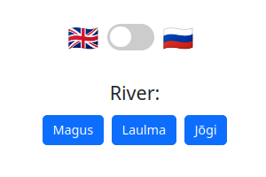
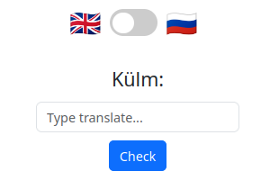

# Dictionary

## Intro

A small mini game where you need to translate different words from Estonian into either English or Russian.

## Tech Stack

* Next.js
* Python Flask
* MongoDB
* Nginx

## Installation

### Docker

1. Build frontend

       docker compose -f ./docker-builder-compose.yaml up -d
       docker exec -it dictionary-frontend-builder bash -c "cp -r /app/out/* /app/build"
       docker compose -f ./docker-builder-compose.yaml down

1. Start containers

       docker compose up -d

## Other

### OpenAPI description
    http://localhost:5000/apidocs/

### Start Local Development

    docker compose -f ./docker-compose-mongo-only.yaml up -d
    flask --app dictionary-backend.py run --host=0.0.0.0
    npm install && npm run dev