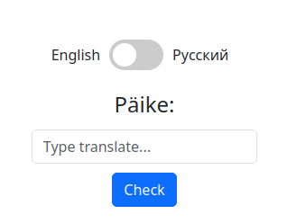

# Dictionary

## Intro

A small mini game where you need to translate different words from Estonian into either English or Russian.

## Tech Stack

* React
* Python Flask
* MongoDB
* Nginx

## Installation

### Docker

1. Build frontend

       docker compose -f ./docker-builder-compose.yaml up -d

1. Start containers

       docker compose up -d

## Other

### OpenAPI description
    http://localhost:5000/apidocs/